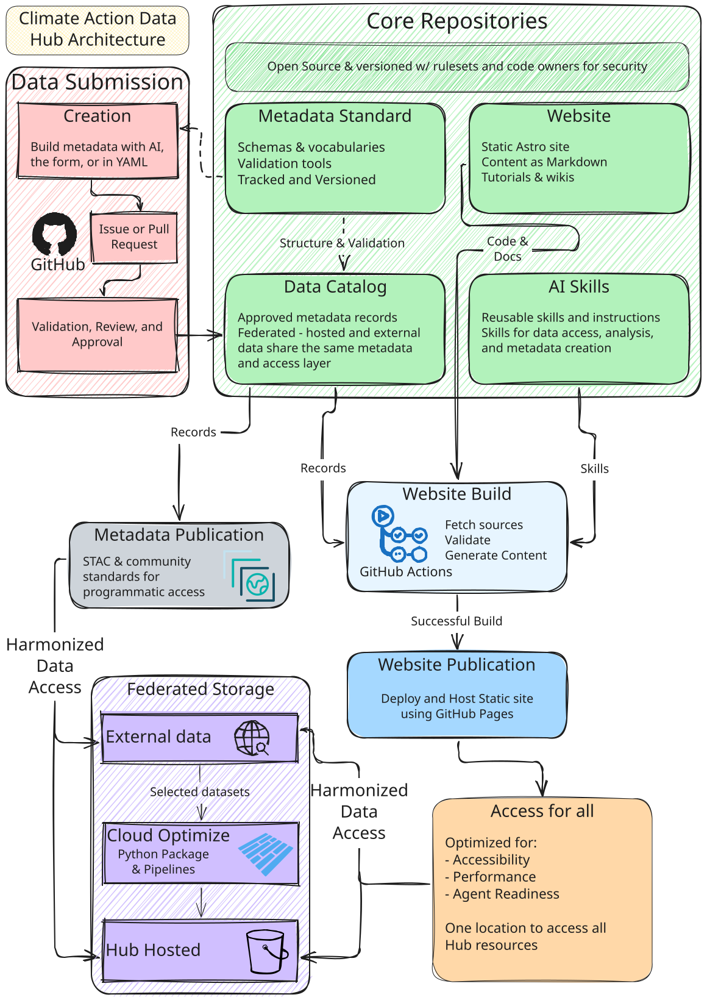

<!--
Technical blueprint deliverable for the Hub.
This page should be the main documnentation for how the hub is build and why.
It should highlight the decisions we made, how the components fit together,
and provide a general overview people can follow to understand how the hub
work and how they can build from it.

This is added as a wiki to the hub, but it is also generated as a PDF
with Quarto and Typst for distribution: `bun run pdf` writes pdfs/architecture.pdf.
Quarto settings live in <root>/_quarto.yml, which also lists the wikis to export.
-->

## Introduction

The Climate Action Data Hub was designed with the core aims of being modular,
sustainable, open, and built on modern technologies and best practices.
Everything is open source and designed to be easily copied, built on, and
modified by others. The overall architecture can be split into multiple
individual components:

- [The metadata standard](https://github.com/CGIAR-Climate-Data-Hub/cdh-metadata-standard)
- [The metadata catalog](https://github.com/CGIAR-Climate-Data-Hub/cdh-catalog)
- [The website](https://github.com/CGIAR-Climate-Data-Hub/CGIAR-Climate-Data-Hub.github.io)
- [The AI Skills](https://github.com/CGIAR-Climate-Data-Hub/skills)
- And, of course, the data itself

This page describes these different components, how they fit together, and why
the design choices were made.

These components are maintained in separate repositories so they can be used and
developed independently. For example, the metadata standard can be adopted
without using the catalog or website. The catalog can be explored through the
website or accessed directly by other tools and applications. If these were all
grouped together, these usage patterns would be much less explicit and
development and maintenance would be much more complex. This approach keeps
things simple, easy to navigate, and flexible.

### Architecture Overview



## General Conventions

### Version Control and Review

The Hub's code is open source and licensed for reuse. Changes are
version-controlled with Git and reviewed through GitHub pull requests.
Conventional Commits provide a consistent way to describe changes, while pull
requests document their purpose, expected behavior, and allow additional reviews
and quality checks. Repository permissions, branch rules, and code ownership
establish review responsibilities and control how changes are approved and
merged. These steps and rules are in place to ensure that the Hub is a reliable
source of information and data and keeps code maintainable for long-term
sustainability. The Hub uses automated checks through GitHub Actions to help
identify problems early and assist in human review.

### AI-Assisted Development

The Hub uses AI tools to prototype ideas, develop features, and speed up
development. These tools allow The Hub to respond to feedback and deliver
improvements faster and with fewer resources. However, the use of AI is guided
by the need to keep the Hub usable and maintainable beyond its initial
development team and funding period, as a high-quality product. Therefore,
AI-assisted contributions follow the same quality and review requirements as
other contributions.

Contributors are responsible for understanding the generated code they submit,
checking its behavior, and ensuring it follows the repository's conventions.
Accepting generated code solely because it appears to work is insufficient for
production use, and passing automated tests alone does not establish correctness
or maintainability.

AI tools assist with implementation, debugging, documentation, and review, while
human contributors remain accountable for design decisions, scientific
correctness, and long-term maintainability. This development prioritizes small,
focused changes and documentation that is readable and understandable to other
developers. Existing development patterns are reused where appropriate and
documentation and comments explain decisions and assumptions that future
maintainers need to understand.

Repository-level `AGENTS.md` instructions, development skills, and access to
relevant documentation through MCP servers help coding agents follow project
conventions. Automated checks, linters, and human code review provide additional
quality controls.

## The metadata standard

A Hub record exists to make a resource discoverable, understandable without
opening the underlying files, citable, validatable against a schema, and usable
without manual interpretation. The Hub needed a standard that was easy to
author, AI agent-ready, easy to validate, easy to render site pages from, and
flexible enough to cover different data formats, tools and platforms, reports,
and other resources. Many fantastic community formats exist (_i.e._, STAC, OGC
API Records, DataPackage, etc.), but none are generic enough to cover all the
Hub's needs without some pros and cons. The Hub did not want to reinvent the
wheel, so rather than trying to create a new metadata standard from scratch, it
designed a standard 'Authoring Format' that was specifically designed to be
mapped to existing community formats - similar to and inspired by
[pygeometa](https://github.com/geopython/pygeometa) or
[portolan](https://www.portolan-sdi.org/). Hub records allow one authoring
format which can then be converted into widespread community formats for
downstream use and publishing - Geospatial records become STAC, Tabular records
become Frictionless DataPackages, etc.

The standard is deliberately generic underneath the CGIAR and Climate Action
-specific parts: a project outside the Hub can adopt just the core schema, or
compose its own extensions on top, without inheriting any Hub policy.

### Design and validation model

The standard is intended to be written as YAML to make it easier to author and
more human-readable. It can then be validated using JSON schema, which also
provides autocomplete, descriptions, examples, and useful error messages. This
also makes the metadata easier to author for AI agents as they can read the
schema and validate their work as they go.

The metadata standard publishes a core JSON Schema plus a Hub profile that
requires five Hub-maintained extensions: `cdh`, `climate`, `datacube`,
`classification`, `agriculture`. It was designed this way to allow outside
projects to easily reuse the core fields, and add custom extensions for
additional fields as needed. This will allow them to use much of the tooling the
Hub has built for its needs without needing to adopt fields which may not be
relevant to them or cover their needs.

The Hub has adopted the [RFC 2119](https://tools.ietf.org/html/rfc2119)
requirement levels (Required/Recommended/Conditional/Optional) for each field in
the standard, and the schema + some additional validation rules enforce them.
Validation itself has two independent layers: a _mechanism_ check (core plus
exactly the extensions a record declares in `extensions[]` — fields from an
undeclared extension are rejected outright) and a _profile_ check (policy on
top, such as the CDH profile's requirement that every record carry the `cdh`
extension). That split is what lets an outside adopter reuse the mechanism
without adopting CGIAR's policy. The core required fields of `id`, `title`,
`description`, `resource_type`, `cdh.domain`, `keywords`, `license`, a
`licensor` contact, `citation`, and `data` address "can someone find,
understand, cite, and access this," with other sections optional until it
applies.

Controlled vocabularies (`vocab/domain.json`, `commodity.json`,
`geography.json`) constrain the closed-vocabulary fields for easier filtering
and linking to external vocabularies, such as AgroVOC and UN M49 geographies.
These links improve machine interpretability and interoperability across
datasets and tools.

Along with controlled vocabularies, the Hub adopted multiple fields directly
from STAC and other standards and provides mapping files within the standard
repo to translate between the Hub fields and these community fields. For STAC,
the Hub includes which STAC extensions apply (Datacube, Table, Raster,
Classification, Version, …), and explicit rules for when a fact belongs on the
Collection, an Item, a `summaries` entry, or an Asset. The Hub is currently
working on Python tooling to easily convert from Hub metadata records to STAC,
and will add additional community standards in the future.

Other fields were chosen specifically to help guide users, both human and AI
agents, improving interpretation resulting in more robust workflows. These
fields, such as `note` and `not_recommended_for` are intended to guide the user
away from common pitfalls, biases, and misusages. These can be used to direct
users to alternate data sources for their needs, explain dataset directionality,
and provide additional warnings and guidance in how a dataset is intended to be
used.

The
[`glw4-2020` record](https://github.com/CGIAR-Climate-Data-Hub/cdh-catalog/blob/main/records/glw4-2020/glw4-2020.yaml)
is a good illustration of the standard: a `note` field carries the projection
caveat that would otherwise mislead anyone doing area-based analysis, `keywords`
mixes plain search terms with a linked AGROVOC concept, and `contact` entries
carry distinct `roles` (`licensor`, `producer`, `processor`, `point-of-contact`)
rather than one undifferentiated author list.

### Additional Metadata Tooling

To assist in authoring and publishing records, the Hub has developed multiple
tools. For users familiar with AI agents and data workflows, the Hub provides an
AI agent Skill to help author and fill in the metadata fields for new datasets.
This skill allows the Agent to fill in fields automatically based on the actual
data file (_e.g._, the bounding box, data type, column/layer names, etc). It
then works with the user to fill in the remaining fields and validates the
record to catch any errors. More about AI skills and why the Hub uses them can
be found in the [Skills section](#agent-skills) of this document, and on the
[Skills Github](https://github.com/CGIAR-Climate-Data-Hub/skills).

For users who prefer a more manual workflow, but don't want to hand-write YAML
in a code editor, the Hub provides a simple form-based workflow in the
[Metadata Submission App](https://github.com/CGIAR-Climate-Data-Hub/CDH-metadata-app).
This is a lightweight and static web app that allows users to create a new
record or upload an existing one for easier editing. The form includes
autocomplete, field descriptions, and immediate validation against the standard,
so errors can be caught immediately. The app also has a built-in AI agent which
can assist in filling in some of the metadata fields, and it can be activated by
providing a free API key. This app is also intended to simplify the submission
process, and it allows users to open a request to add the record directly in the
Hub Catalog with minimal technical knowledge.

The Hub is also developing a Python package for working with the standard at
[`cdh-metadata-tools`](https://github.com/CGIAR-Climate-Data-Hub/cdh-metadata-tools).
This Python package is inspired by
[pygeometa](https://github.com/geometa/pygeometa) and will provide tools and
functions to read, write, and validate records, while also providing the
interface to convert records to STAC, OGC API Records, Datapackage, and other
community metadata formats. `io.py` reads the raw authoring YAML, `model.py`
parses it into a typed `CDHRecord`, and a small registry of pluggable output
schemas (`STACOutputSchema`, `OGCRecordsOutputSchema`) encodes that typed record
into the target format - `metadata-tools generate --schema stac` It is intended
to be wired into the CI systems of the Hub, publishing records in the Hub STAC
Catalog and other systems as they are submitted.

### Publishing and versioning

All changes to the standard are tracked in a changelog following the
[Keep A Changelog Conventions](https://keepachangelog.com/en/1.1.0/) and
releases use [Semantic Versioning](https://semver.org/).

The standard, its schemas, vocabularies, and extensions all share one version
tag. Each release publishes the schemas, vocabs, and extension definitions to a
versioned URL (`<tag>/schemas/…`) on GitHub Pages, plus an unversioned mirror of
the vocabularies so `themes[].scheme` URIs stay stable across releases. A
record's cdh_schema_version identifies the release against which it should be
validated. Published release artifacts and their validation dependencies remain
fixed, allowing existing records to continue validating against their declared
version as the standard evolves. Each release also includes a versioned
Authoring Guide and Specification Document describing the metadata fields, their
definitions, and their intended use.

Published, versioned schemas support validation and integration with tools such
as language servers and the metadata submission app described above. They
provide a single source of truth, reducing drift between the standard and the
tools that implement it. Explicit version references allow downstream tools to
adopt schema changes deliberately. Changes and releases are subject to automated
checks and tests to detect errors before publication and reduce the risk of
breaking downstream workflows.

## CDH Metadata Catalog

Hub records are recorded and published in the
[CDH Catalog](https://github.com/CGIAR-Climate-Data-Hub/cdh-catalog). The full
catalog is managed with Git and kept in a public GitHub repository, with all
accepted records merged into the `main` branch. This tracks submissions, review
decisions, and changes, with Git preserving the version history of published
records for transparency and future reference. The full catalog can be
downloaded or cloned, allowing others to archive, reuse, and maintain it
independently of the Hub's website and infrastructure.

Currently there is a small number of records (including
[mapspam](https://github.com/CGIAR-Climate-Data-Hub/cdh-catalog/blob/main/records/mapspam2020/mapspam2020.yaml)
and
[glw4](https://github.com/CGIAR-Climate-Data-Hub/cdh-catalog/blob/main/records/glw4-2020/glw4-2020.yaml))
which can be used as an example and guide for additional records.

### Catalog Submission

When a new dataset and record is submitted to the Hub, an Issue or PR is opened
in this repository. This triggers multiple automated validation pipelines, and
if the record is not valid against the Hub Metadata Standard the author is
notified with a helpful error message, and the addition to the Hub is blocked
until the record is fixed. Following the automated validations, the record is
reviewed by a member of the Hub team. This review is used to check the metadata
for understanding and completeness against the standard, and allows the team to
fill in and edit any fields that are missing or unclear. It also allows the team
to determine the dataset's suitability for the Hub - some records may be
rejected if they are not appropriate, out of date, or not related to the aims of
the Hub. Following review and approval, the record is then merged to the `main`
branch. This step is critical to ensure that the Hub provides consistent,
useful, and scientifically robust data and metadata. This also adds an
additional safety step by forcing all records to be independently reviewed,
validated, and approved before they are published.

### Catalog Publication

A submitted record is published when it is merged into the main branch. This
triggers workflows that update downstream products.

A GitHub Actions workflow sends a repository_dispatch event to trigger the build
pipeline, rebuilding the Hub website with the updated catalog through the
[build pipeline](#build-pipeline). This allows the catalog to remain as the
canonical source of metadata records, while automated builds keep the website
aligned with it and reduce the need for manual updates.

An additional workflow, currently under development, will use the
[cdh-metadata-tools package](#additional-metadata-tooling) to convert records
into STAC and other community formats and publish them to cloud storage for
distribution and usage.

## Data storage and distribution

The Hub is designed to be a federated, cloud-native data platform. Datasets can
be hosted in Hub-managed cloud storage or remain with external providers, while
being discoverable and accessible through the same catalog. This approach
reduces unnecessary duplication of data that are already openly and easily
accessible. Shared metadata provides a consistent interface for users,
applications, and AI agents to discover, interpret, and access datasets across
providers, and allows users and producers to work with datasets through their
preferred tools and workflows.

The Hub prioritizes open data and supports the Accessible principle of FAIR by
promoting documented, machine-accessible links to data and metadata. The
independently maintained catalog also supports the preservation of metadata when
source datasets become unavailable. All data in the Hub must carry a license and
usage restrictions must be explicitly documented.

Beyond discoverability and access, the Hub aims to make large datasets practical
to use. Cloud-optimized formats such as Cloud Optimized GeoTIFF (COG), Zarr, and
Parquet allow applications to retrieve relevant portions of datasets without
downloading them in full. This can reduce bandwidth, local storage, and
computational requirements, lowering barriers to scientific analysis and machine
learning, particularly for users with limited connectivity or computing
resources.

### Hub Data Storage and Processing

Where datasets are already available from reliable providers with suitable
access methods, the Hub prioritizes cataloging and linking to those existing
assets. Where access is limited by file formats, download requirements, or
hosting arrangements, the Hub can process and host a copy to improve usability,
subject to the source license.

Any Hub-produced versions retain clear links to the original dataset and
document the processing applied, including changes to format. This helps users
distinguish source data from derived products, assess their suitability, and
reproduce the processing where needed.

To support the preparation of analysis-ready, cloud-optimized (ARCO) datasets,
the Hub provides a Python package and a data pipeline which can be used to
process and publish datasets. The
[CDH Data Pipeline repository](https://github.com/CGIAR-Climate-Data-Hub/cdh-data-pipeline)
contains the package and dataset-specific “recipes” that define how source data
are retrieved, processed, and published for the Hub. This is inspired by
[Pangeo Forge](https://pangeo-forge.org/) and makes dataset preparation
repeatable and transparent. Version-controlled recipes document the processing
steps, allowing others to inspect, reproduce, and adapt the workflows for their
own use.

Together, these practices support FAIR data reusability by preserving
attribution, licensing, and provenance alongside improved access.

Hub-managed datasets are stored across multiple cloud providers, depending on
dataset size, access requirements, and hosting agreements. The Hub primarily
uses Cloudflare R2, whose absence of data egress fees helps sustain access to
large climate datasets without high download-related costs for the Hub. Selected
datasets are also hosted on Amazon S3, with the aim of publishing specific
high-impact datasets directly through the AWS Data For Good catalog.

Regardless of storage location, datasets are described through the same catalog,
providing consistent discovery and access information across providers.

## The Hub website

The Hub website provides an easy-to-navigate interface for discovering datasets
and understanding their potential uses and limitations. It also brings together
dataset tutorials and code examples, wikis on data and climate analysis, and
information about the Hub's mission and how to contribute. Dataset information
is drawn from the Hub Catalog, which remains the canonical source of metadata
records.

### Static Architecture

The website is built as a static site: pages are generated during the build
process and served as HTML, CSS, and JavaScript. Static generation suits the Hub
because catalog content changes through reviewed submissions and releases. Pages
are rebuilt when those changes are published and then served directly to
visitors, without requiring an application server or database to operate and
maintain.

Dataset metadata are included directly in the generated HTML, making them
accessible to search engines and automated clients without requiring JavaScript
execution to retrieve the core content. This supports FAIR findability by
exposing catalog information through individually addressable web pages.

This architecture reduces hosting costs, operational complexity, and ongoing
maintenance requirements, as minimal infrastructure is needed to operate the
website. It also improves security as there are no server or database endpoints
which could be exploited. Once deployed, the published pages remain available
independently of the systems used to build them.

Static hosting also improves operational resilience. Serving published pages
requires no application process or database that could crash, become overloaded,
or lose connectivity. Problems with source repositories or the build pipeline
can delay updates without interrupting access to the existing website. Hosting
and network outages remain possible, but fewer runtime dependencies reduce the
ways the website can become unavailable to users.

These characteristics support the Hub's long-term sustainability. Services such
as GitHub Pages and Cloudflare Pages offer free hosting options for static
websites, reducing dependence on continued project funding. The generated files
can be copied, archived, or transferred to another hosting provider, while the
source code and build configuration allow others to clone the repository,
rebuild the site, and publish their own copy. Together, these options support
continued access to the published catalog and documentation even if the original
Hub deployment is discontinued.

### Website Tech Stack

#### Astro

The website uses Astro, a framework well-suited to static content and
documentation websites. Astro generates pages from Markdown and structured data
such as YAML, simplifying authoring of content and integration with the Hub
Catalog. Astro uses an HTML-first approach that limits JavaScript to interactive
features such as search, filtering, and maps. This allows a modern user
experience while keeping the website lightweight, fast, and readable,
particularly benefiting users with limited bandwidth or computing resources.

The site uses multiple plugins to add functionality, including Sätteri for fast
and efficient markdown rendering, Shiki for syntax highlighting, and
astro-pagefind for client-side search. These limit the number of tech components
the site needs to hand-build and maintain, while keeping the dependencies
limited to widely-used community packages.

#### Code Maintenance

The website uses TypeScript for static type checking and Biome for linting and
consistent code formatting. These tools help catch common errors early, reduce
inconsistencies, and make the codebase easier to review and maintain. Astro's
own checks complement them by validating types and identifying issues in .astro
components.

### Build pipeline

The Hub website leverages GitHub Actions to build and deploy the production site
to GitHub Pages. It can also be built locally in a compatible JavaScript
environment, and the generated static files can be deployed to other hosting
platforms (_e.g._, Cloudflare Pages). GitHub Pages was chosen as an initial host
due to its ease of setup; however, Cloudflare Pages may be used in the future to
provide greater control and features supporting AI agents. The static
architecture allows the website to move between providers with minimal changes.

During each build, the website fetches catalog records and agent skills directly
from their respective repositories. This keeps those two standalone products as
the source of truth, preventing drift and reducing maintenance overhead.
Environment variables allow developers to use local directories, select
different branches, or point to alternative repositories to build a custom
catalog. Local content examples also support development without fetching the
full catalog, which is useful where connectivity is limited.

The production build is triggered on every applicable update to the main branch
of the catalog repository, the skills repository, or the website repository.
This ensures that the website always shows the most up-to-date content submitted
to the Hub. The build process installs dependencies using the lockfile,
retrieves source content, and validates it against the website's content
schemas. These checks cover catalog records, skills, tutorials, wikis, FAQs, and
other content collections. Malformed metadata, code issues, bad dependencies,
missing required fields, or incorrect types cause the build to fail. A failed
catalog fetch or an empty catalog also stops the build, helping prevent an
upstream outage or configuration error from publishing an empty catalog.
Deployment runs only after the validation and build completes successfully. If
the build fails, the existing production site remains available.

This design keeps the website up-to-date with the latest content through
automated rebuilds, while ownership and control remain with each source
repository. Validation checks and deployment safeguards reduce the risk of
publishing invalid content or a downstream failure causing a production outage.

### Design Principles and Modern Standards

The Hub website prioritizes accessibility, discoverability, and efficient access
for people and automated tools. These goals complement the Hub's FAIR data
practices by helping users find, understand, and access its published resources.

#### Accessibility

To ensure the Hub is accessible to all users, the website has a strict target
score of 100 in Lighthouse's accessibility audits for tested pages. Any changes
to the codebase are unable to be merged unless they pass this check. This checks
for descriptive links, alternative text for informative images, sufficient color
contrast, keyboard navigation, and visible focus indicators, among others.
Native HTML controls are preferred, with ARIA labels, roles, and states added
where needed to communicate interactive behavior to assistive technologies.
These automated checks cover only a subset of accessibility requirements and are
supplemented by manual testing and review.

#### Performance and SEO

The website prioritizes lightweight pages, limited JavaScript, optimized images,
and responsive layouts to support users across devices and connection speeds.
Descriptive page titles, Schema.org structured metadata, sitemaps, and crawlable
links help search engines, crawlers, and AI agents discover and interpret its
content. Dataset descriptions are available directly in HTML, with links to the
underlying catalog records and data assets. For more about how the Hub website
is built for use by AI agents, see [Agent Readiness](#agent-readiness) below.
Together, these practices support fast page delivery and make the Hub's
resources easier to discover and access.

Alongside accessibility checks, the repository runs Lighthouse performance and
SEO audits on each pull request to identify regressions and opportunities for
improvement before changes are merged.

### Agent Readiness

The Hub recognizes that AI is rapidly changing how people access information and
is designed to support both people and AI agents. Alongside standard HTML pages,
the Hub generates Markdown and JSON representations at build time to support
different access needs. These share the same source content, reducing
duplication and keeping the human- and machine-readable versions aligned.

Eligible wiki, tutorial, and dataset pages are available as Markdown at
<page>/index.md URLs, allowing agents to read the content with less HTML
processing and potentially fewer tokens. Generated llms.txt and llms-full.txt
files provide a compact site guide and an expanded content reference for tools
that support this convention.

Pages also include Schema.org metadata to support discovery by search engines
and automated tools. A `catalog.json` publishes the full catalog as a Schema.org
DataCatalog, while a `/catalog/<id>.json` provides each record's metadata. A
directory at `/.well-known/api-catalog` points agents to the available
endpoints. These are based on up-and-coming and already established standards
for modern access patterns. In compatible browsers, WebMCP tools allow agents to
search the catalog, retrieve records, and list available agent skills.

Cloudflare's Agent Readiness assessment helps identify opportunities to improve
automated discovery and access, with recommendations assessed against the Hub's
needs and hosting capabilities. The current interfaces and agent skills are
documented on AI and agent access.

## Agent skills

### Introduction

Across the institutions that make up CGIAR, researchers spend much of their time
on the same kinds of tasks: downloading datasets, defining methodologies,
running analytical protocols, and assembling information for their studies. In
practice, each center tends to rebuild these processes on its own — the same
workflow reinvented in a dozen places, with little that can be handed off or
reused across institutions. The aim of this work is to change that: to capture
each process once, in a form that is reproducible and easy to share, so that
both the data and the methods behind it can be picked up and reused by another
institution with as little friction as possible.

#### Simplifying geospatial processing

The Hub's datasets are cloud-native and machine-readable, yet turning them into
a usable result still demands knowledge that most researchers don't carry day to
day: which source holds which variable, how to clip a raster to an
administrative boundary, which aggregation method preserves the correct units,
how to compute a seasonal indicator over a spatial grid, and what fields the Hub
metadata schema requires.

#### Standardizing workflows via AI agent skills

The agent-skills work set out to close that gap — to let a researcher state what
they need in plain language and have an AI agent carry out the full workflow
correctly, from raw download to a shareable output.

A skill is a set of instructions that tells an agent how to accomplish a
specific goal: what to ask the user, in what order to perform each step, and
what a correct result looks like. Its purpose is standardization. Instead of
every conversation reinventing how a task is done, the same procedure runs the
same way each time — regardless of who is asking or which agent is executing it.

In practice, each skill is a plain-text SKILL.md file: YAML frontmatter that
tells the agent when to trigger the skill, followed by Markdown instructions
describing the workflow. Optional folders can bundle helper scripts, reference
documents, and templates alongside it.

#### Why AI agent skills?

The Hub considered other ways to deliver these workflows. A bespoke chatbot
would need its own server, authentication stack, and ongoing maintenance, and
would be tied to a single AI provider. A custom API wrapper would remove some of
that burden but would still leave the user writing code to call it. Agent skills
take a different approach. Because a skill is just an open-format text file, any
compatible assistant can load and follow it — Claude Code, OpenAI Codex, and
Antigravity all read the same skill folder. Each workflow is therefore published
once and works everywhere, with no server to operate and no vendor lock-in.

#### Supporting Multi-Modal execution personas

The workflows were designed with two kinds of users in mind. The first is
comfortable with programming and with AI agents, and wants direct, scriptable
control; the second needs to reach a result quickly using only plain-language
prompts, without touching code. For the first profile, the Hub documented use
through the terminal with Claude Code. For the second, the Hub relied on more
guided, GUI-driven agents such as Antigravity or Codex. In every case the
end-user experience is the same: describe what you need in one sentence, confirm
the proposed plan, and receive a ready to use output.

### Methodology

#### Skills creation

Each skill was built and iterated using Anthropic's
[skill-creator](https://github.com/anthropics/skills) — an open meta-skill that
interviews you about the task, drafts a `SKILL.md`, proposes test prompts, runs
them in parallel (with skill enabled vs. without), and shows outputs
side-by-side with pass rates. The loop is: describe the task → review the draft
→ run evals → leave feedback → skill-creator rewrites and re-runs — until pass
rates are satisfactory. This process keeps skill writing grounded in observed
agent behavior rather than intuition about what instructions should work.

#### Repository structure

Skills live in the `.agents/skills/` folder of the skills repository, one
subfolder per skill, each holding a required `SKILL.md` plus whatever
`references/`, `evals/`, or `assets/` that skill needs:

```
skills/
├── skills.json                    # index: skill name → SKILL.md path
├── skills-lock.json               # content hash per skill, checked before install/update
├── .agents/
│   ├── AGENTS.md                  # repo-level agent instructions
│   ├── mcp_config.json
│   └── skills/
│       ├── climate-data-download/
│       │   ├── SKILL.md
│       │   └── references/
```

Every skill folder is self-contained and independently loadable — an agent only
needs the one subfolder its plan resolves to, not the whole repo — which is what
lets a foundational skill be updated without touching the orchestrators that
call it.

#### Underlying Python packages

Most foundational skills are conversational wrappers around two Python packages
— [`aggeodata`](https://github.com/CGIAR-Climate-Data-Hub/aggeodata) for data
acquisition and
[`ag-cube-cm`](https://github.com/CGIAR-Climate-Data-Hub/ag-cube-cm) for crop
model orchestration — described in [Python packages](#python-packages) below. A
skill's job is to collect parameters, confirm a plan, and hand off to the
package; the package does the actual download, processing, or simulation.

#### Design pattern: foundational skills + orchestrators

The work was decomposed into single-responsibility _foundational skills_, each
owning one well-defined task. _Orchestrator skills_ sit on top: they collect
parameters, confirm a plan with the researcher, then delegate each stage to the
relevant foundational skill rather than re-implementing it. Any foundational
skill can therefore be used alone or updated without touching the orchestrators.


### Results

#### Scoping

These are the skills that were developed to be used across different use cases;
the idea is that when multiple projects share similar activities, those
processes can be standardized into common steps.

This is an initial set that will expand following CGIAR project requirements.

The foundational skills developed so far are:

**Data acquisition**

| Skill                   | What it does                                                                                                                                                |
| ----------------------- | ----------------------------------------------------------------------------------------------------------------------------------------------------------- |
| `climate-data-download` | Routes each variable to its authoritative source (CHIRPS, CHIRTS-ERA5, NASA POWER, AgERA5), shows a plan, and fetches in sequence                           |
| `soil-data-download`    | Downloads SoilGrids global soil property rasters (clay, sand, silt, bulk density, organic carbon, pH) and stacks them into a validated NetCDF soil datacube |

**Spatial processing and visualization**

| Skill                       | What it does                                                                                                                                           |
| --------------------------- | ------------------------------------------------------------------------------------------------------------------------------------------------------ |
| `geospatial-cube-processor` | Clips rasters to admin boundaries (GADM), stacks multi-source datasets onto a common grid, computes zonal statistics, exports Cloud Optimized GeoTIFFs |
| `notebook-plots`            | Inserts interactive Plotly chart cells into an existing Jupyter notebook; exports a standalone Plotly HTML file alongside it                           |
| `climate-dashboard`         | Builds a self-contained Chart.js HTML dashboard — KPI cards, filters, sortable table — that opens in any browser with no server                        |
| `sciplot-skill`             | Generates publication-ready matplotlib figures meeting the typography and resolution standards of high-impact journals (Nature, Science, Cell)         |

**Hub utilities**

| Skill          | What it does                                                                                                                                                   |
| -------------- | -------------------------------------------------------------------------------------------------------------------------------------------------------------- |
| `cdh-metadata` | Inspects a geospatial dataset, asks for fields it cannot derive automatically, and writes a valid CDH YAML metadata record ready for submission to the catalog |

So far, only two use cases have been considered: GCF and AgWISE. These skills
are likely to be reused across other projects too, since climate information is
required well beyond either of them — that reuse is the whole point of building
foundational skills.

#### Use cases

##### GCF climate data access

Green Climate Fund (GCF) proposals need a defensible climate rationale —
grounded in subnational climate and agricultural data — to justify the case for
funding. Producing that evidence today is slow and manual: sourcing the right
variables per country, clipping them to the right boundary, and assembling the
tables a Concept Note or Funding Proposal expects. The `gcf-pipeline`
orchestrator automates that data-gathering step, so a proposal writer states
what they need and gets back ready-to-use tables, rasters, and figures instead
of raw downloads.

The `gcf-pipeline` orchestrator enforces six explicit gates, so no stage runs
before the researcher has approved the plan:

1. **Collect parameters** — country, variables, date range, output folder, admin
   level, aggregation method, temporal frequency
2. **Confirm plan** — the agent shows exactly what will be downloaded and how it
   will be processed; nothing moves until the researcher approves
3. **Download** — delegates to `climate-data-download`, which fetches the
   required NetCDF files
4. **Process** — delegates to `geospatial-cube-processor`, which clips,
   aggregates, and exports a CSV and COG per variable
5. **Visualize** — delegates to `notebook-plots` and `climate-dashboard` in
   parallel; both outputs are produced by default
6. **Summary** — lists every output path and its size

The confirmation gate at step 2 is the most important: it surfaces mis-routing
(wrong variable, wrong boundary level) before a long download begins rather than
after.

##### AgWise spatial crop modeling

AgWise is a CGIAR framework that turns field-trial, market, topography, climate,
and soil data into tailored agronomic recommendations — fertilizer rates,
planting dates, cultivar choice — for partners across Africa. Its fertilization
module depends on process-based crop model simulations, which need
high-resolution climate and soil data run pixel-by-pixel across a region. The
`spatial-crop-modeler` orchestrator closes that gap, driving the `aggeodata` and
`ag-cube-cm` packages end-to-end so the fertilization module always has current,
validated yield inputs.

The `spatial-crop-modeler` orchestrator runs DSSAT pixel-by-pixel over a spatial
domain, combining climate and soil datacubes into a yield map. Its first design
decision is a mode question: whether the datacubes already exist on disk
(`with_cubes`) or need to be downloaded and assembled first (`full_pipeline`).
Skipping unnecessary downloads when the user already has the data is the main
reason the mode exists — the simulation itself is identical in both cases.

Before collecting any parameters the skill runs a silent environment check,
verifying that `ag-cube-cm`, `aggeodata`, and `mcp` are all importable. If any
are missing it stops and shows the exact install command. This prevents the
common failure of reaching step 5 only to discover the simulation tool was never
installed.

The eight gates in `full_pipeline` mode:

1. **Environment check** — silently verifies `ag-cube-cm`, `aggeodata`, and
   `mcp` are installed; stops with the install command if any are missing
2. **Collect parameters** — bounding box, date range, crop name, cultivar code,
   planting date, output directory; for `full_pipeline` also climate sources and
   a suffix label for file naming
3. **Confirm plan** — shows mode, area, period, climate and soil sources, crop,
   planting date, and output path in a single table; no files are written until
   the researcher approves
4. **Generate YAML config** — writes the `ag-cube-cm` config file; flags any
   `working_path` that contains spaces (DSSAT is a Fortran program that fails
   silently on space-containing paths)
5. **Validate config** — runs `ag-cube-cm validate` and resolves any errors
   before touching data
6. **Run simulation** — runs `ag-cube-cm run`; for `full_pipeline` this
   downloads climate via `climate-data-download`, builds the weather datacube,
   delegates soil download to `soil-data-download`, then runs DSSAT across every
   pixel; intermediate files are cached so re-runs skip completed steps
7. **Quality gate** — mandatory before any visualization; checks three
   thresholds: at least 20 % of pixels succeeded (`flag=0`), fewer than 50 %
   failed (`flag=1`), and mean harvest yield (`HWAM`) above 200 kg/ha; a clean
   exit code from DSSAT is not a quality signal — the gate exists because
   `ag-cube-cm` exits cleanly even when the entire domain is over water or the
   planting season is wrong; if any threshold fails the skill halts, surfaces
   the pixel summary, and diagnoses before proceeding
8. **Visualize** — only after the quality gate passes; delegates to
   `notebook-plots` and `climate-dashboard` for the yield map and summary
   figures

The quality gate at step 7 is the sharpest difference from the GCF pipeline.
Because DSSAT's exit code does not distinguish a successful run from a run that
produced no valid output, a mandatory programmatic check is the only reliable
way to stop a researcher from presenting an all-NaN yield map as results.

#### How to use these skills

Which interface fits depends on the persona described in the introduction — the
workflow underneath is identical either way; only the surface changes.

**Technical users** run skills directly from a terminal-based agent (Claude
Code, OpenAI Codex) with the skills repository already configured. A single
natural-language request is enough; the agent resolves it to a skill, confirms a
plan, and executes:

```
You:   Simulate maize yield potential in Mwanza district, Malawi, 2010–2012,
       planting 2010-11-01, 4 windows, no fertilizer, 8 cores.

Agent: [resolves the request to spatial-crop-modeler]
       → checks ag-cube-cm and aggeodata are installed
       → shows the plan — area, period, crop, sources — for approval
       → runs the pipeline, reports mean yield and output paths
```

**Non-technical users** — proposal writers, partners, anyone without a
development environment set up — go through a GUI-based agent (Antigravity) that
follows the same `SKILL.md` workflow with no command line involved. The prompt
is just as plain; there's no terminal, no install step, no code to read:

```
You:   I need rainfall and temperature data for Togo, 2015–2023, by
       district, for a GCF proposal.

Agent: [resolves the request to gcf-pipeline]
       → shows the same plan a terminal user would see, in the chat window
       → delivers a CSV, a COG per variable, and a dashboard link
```

Both routes run the same skill and produce the same output — only how the plan
is confirmed and the result is handed back changes. See
[Publishing and discovery](#publishing-and-discovery) below for how each
interface is installed.

### Publishing and discovery

Skills live in
[github.com/CGIAR-Climate-Data-Hub/skills](https://github.com/CGIAR-Climate-Data-Hub/skills),
separate from the site source. The Hub fetches them at build time via the
`skills()` Astro loader (`src/lib/skills.ts`), using the same mechanism as the
catalog fetch from `cdh-catalog`. A `skills.json` index at the repo root maps
each skill name to its `SKILL.md` path; agents resolve that index and verify the
content hash recorded in their local `skills-lock.json` before installing or
updating, so researchers always run the version they checked.

The repository also ships deployment guides for Antigravity and OpenAI Codex
alongside the Claude Code guide, so the full pipeline is accessible to
researchers who do not have a paid Claude subscription.

### Python packages

Two open-source Python packages do the heavy lifting behind the foundational
skills — each skill is a thin conversational wrapper around one of them, and
both can be used directly, without an AI agent, by anyone comfortable scripting
the workflow.

#### aggeodata

[`aggeodata`](https://github.com/CGIAR-Climate-Data-Hub/aggeodata) handles data
acquisition: it downloads daily gridded climate data from CHIRPS, CHIRTS,
AgERA5, and NASA POWER, and static soil properties from SoilGrids, then
assembles them into analysis-ready NetCDF datacubes aligned to a common grid and
CRS. A YAML-driven pipeline (`run_download` → `run_datacube`) covers the common
case; each source also has a standalone downloader for one-off use.

#### ag-cube-cm

[`ag-cube-cm`](https://github.com/CGIAR-Climate-Data-Hub/ag-cube-cm) is the
crop-modeling layer: it takes the datacubes `aggeodata` builds and runs a
process-based crop model — DSSAT, CAF2021, SIMPLE, or the pure-Python Banana-N
model — pixel-by-pixel across the domain in parallel, producing a gridded yield
map (kg/ha) across planting windows, years, and space. It performs no downloads
of its own. Both packages ship an MCP server, so an AI agent can drive the same
two-step workflow the `spatial-crop-modeler` skill uses.
